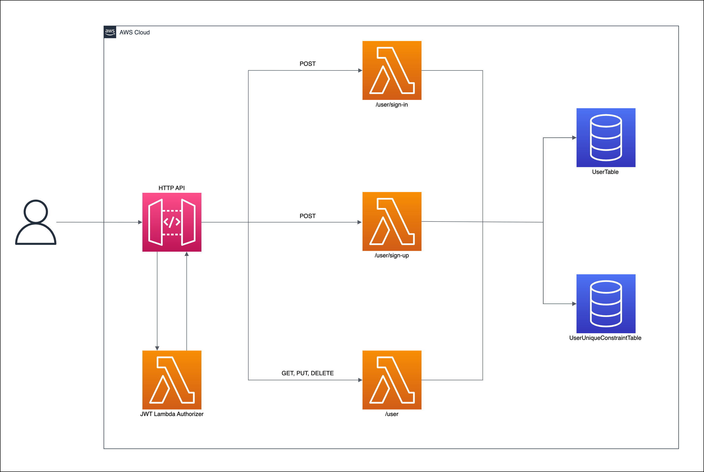

# AWS SAM User Api Template

## Description
This an AST (AWS Serverless Application Model Template) for a user api with simple username and password sign up pair.
Allowing you to create, read, update and delete users.
Authentication is done simply using JWT tokens without Cognito support which uses the minimal amount of resources in AWS.
Only simplest of features are implemented to allow you to build on top of it including the ability to add additional fields to the user model etc.
HTTP API is used as the API Gateway type as it support both with and without authorizer to a route.

## Table of Contents
- [Features](#features)
- [File Structure](#file-structure)
- [Architecture](#architecture)
- [Requirements](#requirements)
- [Implementation](#implementation)
- [Contributing](#contributing)
- [License](#license)

## Features
- [x] User Sign up (Create user)
  - with username and password
  - additional fields can be added
- [x] User Sign in
  - with username and password 
- [x] Get user
  - with userId
  - with username
- [x] Update user
  - non password fields only
- [x] Delete user
  - delete own account after sign in
- [x] JWT Authenticator
- [ ] User password reset
- [ ] Admin user support
  - [ ] Update user
  - [ ] Delete user
  - [ ] Force password reset

## File Structure
```
.
├── src
│   ├── controllers     # Lambda controllers
│   ├── handlers        # Lambda handlers
│   ├── models          # Database models
│   ├── utils           # Utility functions
│   └── ...
├── swagger.yaml        # OpenAPI 3.0 specification
├── template.yaml       # SAM template
└── ...
```

## Architecture


## Requirements
- [AWS CLI installation](https://docs.aws.amazon.com/cli/latest/userguide/cli-chap-install.html)
- [SAM CLI installation](https://docs.aws.amazon.com/serverless-application-model/latest/developerguide/serverless-sam-cli-install.html)
- [AWS CLI configuration](https://docs.aws.amazon.com/cli/latest/userguide/cli-chap-configure.html)
- [NodeJS installation](https://nodejs.org/en/download/)

## Implementation

### User Api
1. Clone this repository
2. Create a Parameter Store entry in AWS for the JWT secret
    - With AWS CLI
      <br>
      `aws ssm put-parameter --name /{ProjectName}/{Env}/user-api/jwt-secret --type SecureString --value <your-secret>`
    - With AWS Console
      <br>
      Go to the AWS Console and navigate to the Parameter Store. Create a new parameter with the name `/{ProjectName}/{Env}/user-api/jwt-secret` and the value of your secret.
3. Update your project name and environment
   - In the `template.yaml` file
     <br>
     Update the `Project` and `Env` parameters
   - Override the parameter when deploy using `--parameter-overrides`
     <br>
     `sam deploy --parameter-overrides Project=<your-project-name> Env=<your-env>`
4. Build the application with `sam build`
5. Remove the `samconfig.toml`from the `.gitignore` file, allowing you to save the deployment configuration
6. Deploy the application with `sam deploy --guided` for the first time and `sam deploy` after that

### Other Apis
After deploying the user api you can deploy other apis with also implementing the JWT authenticator.
```yaml
# only the relevant parts are shown
# more info can be found in the UserApi template
SampleApi:
    Type: AWS::Serverless::HttpApi
    # or AWS::Serverless::Api 
    # if a route must or must not include the authorization header
    # while HttpApi allow a route to have both with and without authorization
    # more details can be found in the AWS documentation
    Properties:
      # the actual authorizer implementation
      Auth:
        DefaultAuthorizer: LambdaRequestAuthorizer
        Authorizers:
          LambdaRequestAuthorizer:
            FunctionArn: !ImportValue JwtAuthFunctionArn
            FunctionInvokeRole: !ImportValue JwtAuthenticatorFunctionInvokeRoleArn
            AuthorizerPayloadFormatVersion: 2.0
            EnableSimpleResponses: true
```

## Contributing
Contributions are what make the open source community such an amazing place to learn, inspire, and create. Any contributions you make are **greatly appreciated**.

### General Steps

1. Fork the project
2. Create your feature branch (`git checkout -b feature/AmazingFeature`)
3. Commit your changes (`git commit -m 'Add some AmazingFeature'`)
4. Push to the branch (`git push origin feature/AmazingFeature`)
5. Open a pull request

## License
This library is licensed under the MIT License. See the LICENSE file.